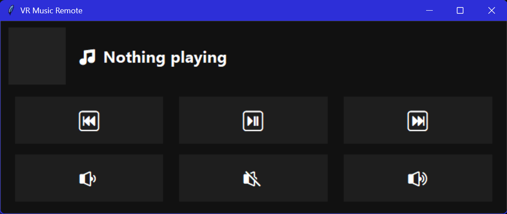
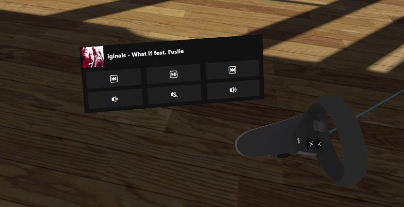

# 🎵 VR Music Remote

**VR Music Remote** is a lightweight, always-on-top media controller designed for VR users.  
It works especially well with **[Desktop+](https://store.steampowered.com/app/1494460/Desktop/)**, allowing you to control system media playback without leaving VR.

The app displays the currently playing track (with album art when available) and provides simple, VR-friendly media and volume controls.

---

## 📸 Screenshot



## ✨ Features

- ▶️ Play / Pause  
- ⏮ Previous / ⏭ Next track  
- 🔊 Volume Up / Down / Mute  
- 🎶 Now Playing title with slow marquee scrolling (VR-readable speed)  
- 🖼 Album artwork via Windows Global Media Session  
- 🪟 Normal window (Desktop+ selectable and crop-friendly)  
- 🖱 Mouse cursor hidden over the window (clean VR HUD feel)  
- 🪶 Lightweight (Tkinter-based, minimal overhead)

---

## 🧠 How It Works

VR Music Remote uses:
- **Windows Global Media Session** to read currently playing media
- **System media keys** to control playback  
  (works with Spotify, YouTube, YouTube Music, VLC, etc.)
- A standard desktop window so tools like Desktop+ can easily capture and display it in VR

---

## 🖥 Requirements

- **Windows 10 or Windows 11**
- **Python 3.10+**
- Desktop overlay software (recommended: **[Desktop+](https://store.steampowered.com/app/1494460/Desktop/)**)

---

## 📦 Installation (Python)

```bash
pip install pillow winsdk
python vr_music_remote.py
```
## 📦 Installation (exe)
 1. **Download the latest `.exe`** from [Releases](https://github.com/ToxicOrca/VR-Music-Remote/releases).
---

## 🚀 Usage (Recommended with Desktop+)

1. Launch **VR Music Remote.exe**
2. Add the window in **Desktop+**
3. Crop out the title bar if desired (see `CropSettings.jpeg` for values I used)
4. Change opacity if desired
5. Position it as a VR HUD
6. Interact using your VR laser pointer
---

## 📄 License

This project is released under the **MIT License**.

You are free to use, modify, and distribute this software.

---

## 🙏 Credits

- **Project Author:** ToxicOrca  
- **Development Assistance:** [ChatGPT](https://openai.com/chatgpt)  
  - Assisted with Python/Tkinter architecture
  - Async media session handling
  - UX refinements for VR use
- **Icon Creation Assistance:** [ChatGPT](https://openai.com/chatgpt)  

[ChatGPT](https://openai.com/chatgpt)   was used as a collaborative development and design assistant throughout this project.

---


